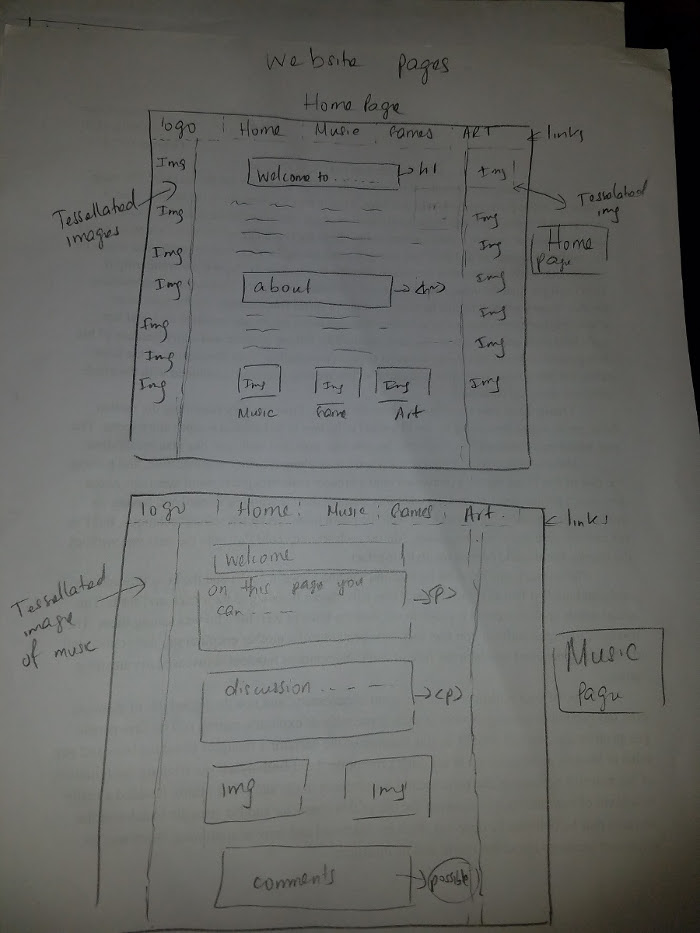
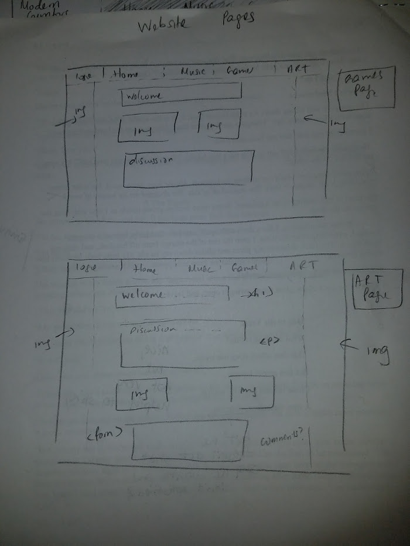
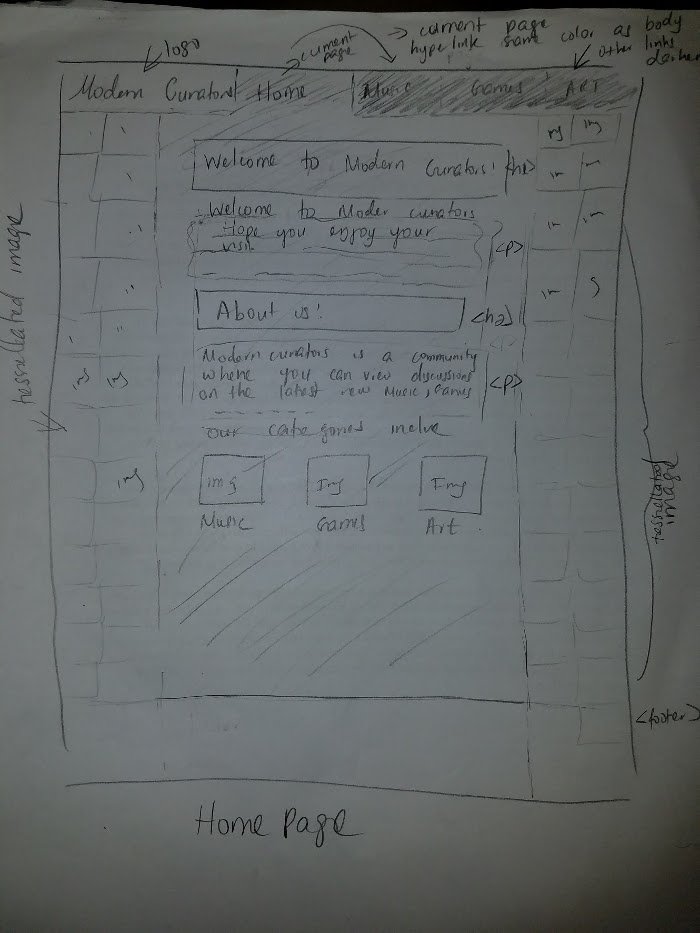
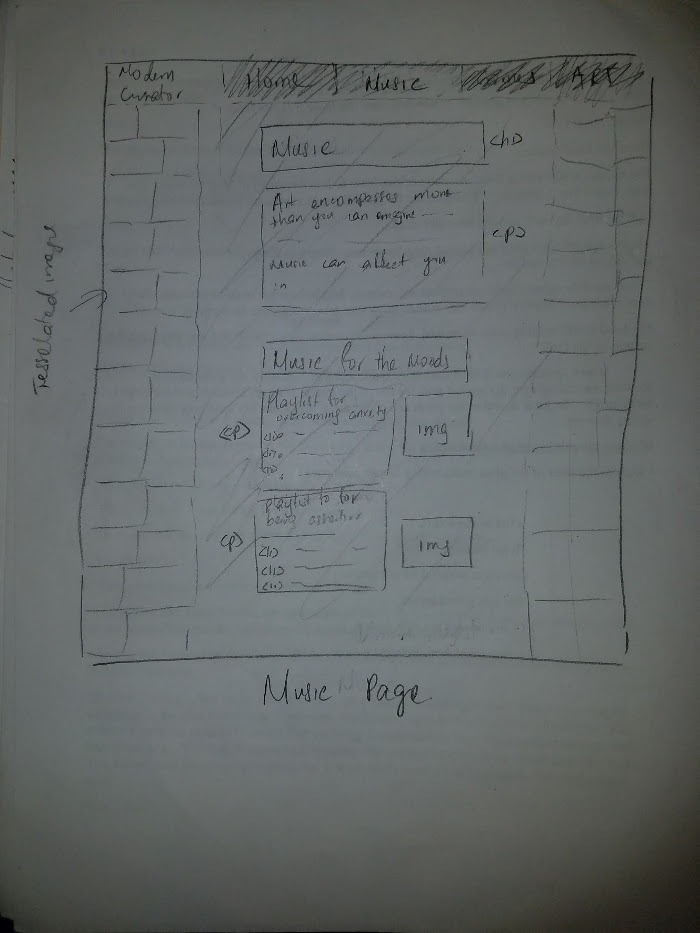
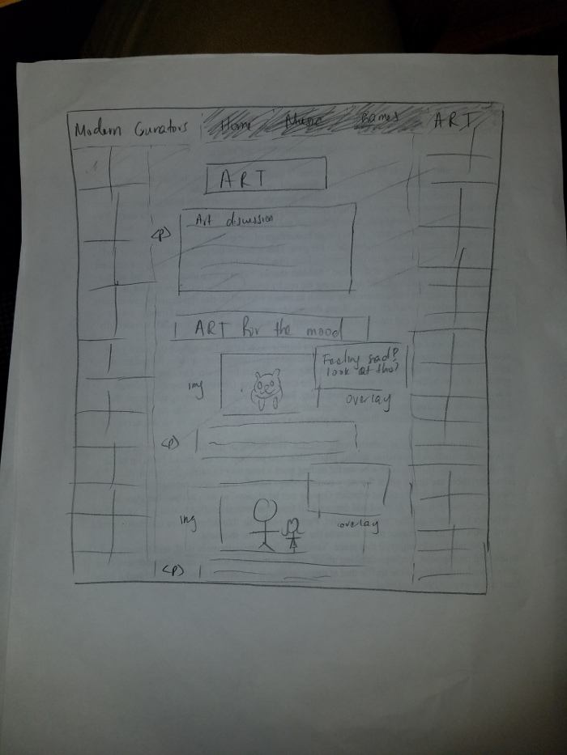
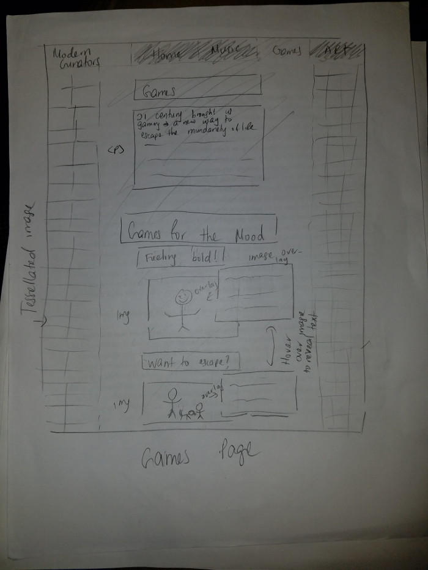

# Project 1, Milestone 1 - Design & Plan

Your Name: Samuel Williams

## 1. Persona

[1. Pick a persona]

I've selected **[Tim]** as my persona.

I've selected Tim as my persona because of his openness to learning new technologies is reflective of the goal of my website, to motive my users to do some exploring of their own by doing things such as play new games, listen to new music or find new art that they could positively affect their lives.

## 2. Sketches

[2. Create some sketches to generate ideas about a website design that would work for your persona.]

[Tell us why your sketches meet the needs of your persona. 1-3 sentences]
My sketches reflect the themes of art, music and games that the user can choose among. These variety of options, allows the learning through process and tinkering that is part of my persona and the structure as seen in the sketch will allow self-efficacy.
[Insert your 2-3 sketches here.]

## 3. Wireframes

[3. Author detailed wireframes that will become the design that you program for the final milestone.]

[Insert your 3-4 wireframes here.]

## 4. Coding Plan & Pseudocode

[4. Author a plan for how you will code your PHP website.]

[Make sure you layout how to you plan to use PHP *includes*.]
 
* Create pages of website with basic structure
* add basic css for alignment, font, sizing...etc
* Incorporate images and color.
* Add more robust css and html coding to page
* Tweak color to make sure it fits well with the theme and look of the website.
* Revise code for any redundant aspects using PHP includes:
    * header.php: ill contain a for each loop for redundant <li tags,
      and user defined function.
    * ini.php: will contain an array of page names and user
* write user defined function for page color uniformity.

[Write your pseudocode for your user defined function.]
 
#### function-uniform_page specs  
Keeps track of the current page the user is on by making the color of the hyperlink of the current page, the same color of the rest of the current page's body, while the other hyperlinks are darker.

###### function uniform_page(current_page_id) 
if (page id is same as current page id)
 
set the color of the page body and the current page hyperlink to be the same color
 
*set the color of the other hyperlinks to darker color 
end if
